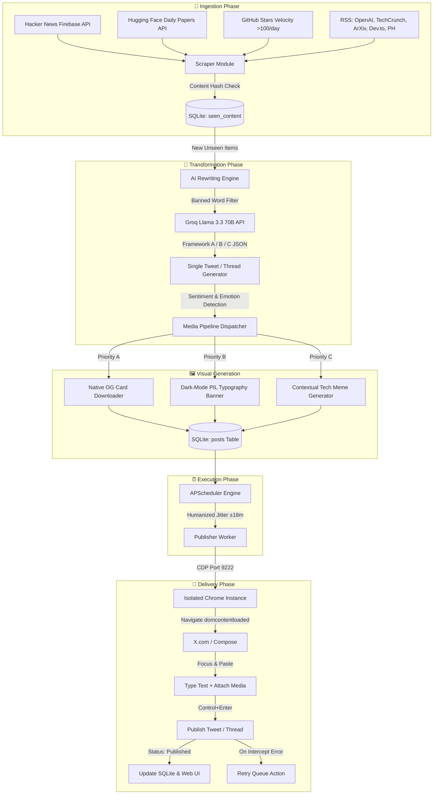

# ⚡ Twitter Autopilot v1.2
> **Note:** The source code for this application is hosted in a private repository to protect proprietary security algorithms and system configurations. This public repository serves as an architectural overview and technical demonstration of the platform.
<p align="center">
  
  
  
  
  
</p>

> **Twitter Autopilot** is a fully automated, self-hosted, narrative-driven Twitter publishing & content curation engine designed specifically for the **AI / SaaS / Tech** niche. It continuously ingests trending tech stories, processes them through high-converting viral storytelling frameworks (Frameworks A, B & C) using Groq Llama 3.3 70B, pairs them with native OG cards, dark-mode PIL typography banners, or contextual tech memes, and publishes them natively via Playwright CDP (Chrome DevTools Protocol) using your real logged-in Chrome session.

---

## 📑 Table of Contents

- [Overview & Key Features](#-overview--key-features)
- [System Architecture & Data Flow](#-system-architecture--data-flow)
- [Nook & Cranny Technical Deep Dive](#-nook--cranny-technical-deep-dive)
  - [1. Chrome CDP Stealth Launcher (`start.bat`)](#1-chrome-cdp-stealth-launcher-startbat)
  - [2. Control Center & Dashboard Server (`app.py` & `static/app.js`)](#2-control-center--dashboard-server-apppy--staticappjs)
  - [3. High-Value Content Discovery (`core/scraper.py`)](#3-high-value-content-discovery-corescraperpy)
  - [4. Viral Narrative AI Engine (`core/ai_engine.py`)](#4-viral-narrative-ai-engine-coreai_enginepy)
  - [5. Visual & Media Hierarchy Engine (`core/media_factory.py`)](#5-visual--media-hierarchy-engine-coremedia_factorypy)
  - [6. CDP Stealth Publisher (`core/publisher.py`)](#6-cdp-stealth-publisher-corepublisherpy)
  - [7. Autonomous Scheduler & Humanization (`core/scheduler.py`)](#7-autonomous-scheduler--humanization-coreschedulerpy)
  - [8. SQLite Persistence Layer (`db/models.py`)](#8-sqlite-persistence-layer-dbmodelspy)
- [Viral Content Frameworks (A, B & C)](#-viral-content-frameworks-a-b--c)
- [Visual Hierarchy & Tech Meme Engine](#-visual-hierarchy--tech-meme-engine)
- [Anti-Bot & Anti-Detection Architecture](#-anti-bot--anti-detection-architecture)
- [Quick Start Guide](#-quick-start-guide)
- [Configuration Reference (`config.yaml`)](#-configuration-reference-configyaml)
- [Troubleshooting & Diagnostics](#-troubleshooting--diagnostics)
- [License](#-license)

---

## ⚡ Overview & Key Features

* **Zero-Subscription Overhead**: Built 100% on top of free-tier APIs and open tools (Groq Llama 3.3 70B, Pollinations AI, Playwright, SQLite).
* **Stealth CDP Automation**: Attaches to a dedicated local Chrome profile via Chrome DevTools Protocol (`port 9222`), completely bypassing Twitter's bot detection, Cloudflare, and browser fingerprinting.
* **Storytelling AI Prompts & Banned Buzzwords**: Hard-bans generic corporate fluff (*Game-changer*, *Delve*, *Paradigm shift*, *Revolutionizing*, *Mind-blowing*, *Unraveling*). Enforces a 7th-grade reading level and max 2 sentences per paragraph.
* **3 Proven Viral Frameworks**:
  * **Framework A (Breakdown / TL;DR)**: For research papers, ArXiv, Hugging Face Daily Papers, and major tech news.
  * **Framework B (Open-Source Alternative)**: For GitHub repos and open-source tools.
  * **Framework C (Workflow / How-To)**: For Show HN items, tutorials, and practical guides.
* **Dynamic Media & Contextual Meme Engine**:
  * **Priority A**: Native OG image and GitHub social card extractor.
  * **Priority B**: Sleek dark-mode PIL typography banner generator (1024x576) with grid accents and key metrics.
  * **Priority C**: Emotion-mapped tech meme generator (*Panicked*, *Disappointed*, *Shocked*, *Relieved*, *Smug*).
* **Multi-Tweet Thread Engine**: Seamlessly posts single tweets or multi-tweet threads with 100% accurate text insertion, focus management, and automatic image attachment to the hook tweet.
* **Resilient Retry Mechanics**: Failed posts due to network drops or UI intercepts can be re-queued with a single click right from the Web Dashboard.

---

## 🏗️ System Architecture & Data Flow



---

## 🔍 Nook & Cranny Technical Deep Dive

### 1. Chrome CDP Stealth Launcher (`start.bat`)
Traditional web automation uses headless Selenium or standalone Playwright contexts, which X.com immediately flags via TLS fingerprinting, canvas probes, and WebGL telemetry. 

Twitter Autopilot bypasses this entirely:
* Launches Google Chrome with `--remote-debugging-port=9222`.
* Isolates profile state inside `chrome-profile/` within the project root directory.
* Suppresses automation flags via `--disable-blink-features=AutomationControlled`.
* **Playwright attaches directly to your active browser context** via `connect_over_cdp("http://localhost:9222")`. Twitter sees a genuine, signed-in desktop browser session with all session cookies intact.

### 2. Control Center & Dashboard Server (`app.py` & `static/app.js`)
The Web Dashboard is powered by a lightweight Flask backend and pure Vanilla JavaScript frontend:
* **REST API Endpoints**:
  * `GET /api/status`: Returns Chrome connectivity, scheduler heartbeat, daily metrics, and queue size.
  * `GET /api/queue` & `DELETE /api/queue/<id>`: Manages upcoming scheduled posts.
  * `POST /api/queue/<id>/publish`: Immediately publishes a specific queued item out of order.
  * `POST /api/history/<id>/retry`: Resets a `failed` post back to `queued` state and clears its error logs.
  * `POST /api/scrape-now`: Triggers an asynchronous scraping and generation thread without blocking the UI.

### 3. High-Value Content Discovery (`core/scraper.py`)
Content discovery pulls raw stories exclusively from high-traction sources:
* **Hacker News Firebase API (`scrape_hacker_news`)**: Queries official `topstories.json` and `showstories.json` endpoints for items exceeding `>100 points`.
* **Hugging Face Daily Papers (`scrape_huggingface_papers`)**: Ingests paper abstracts, upvotes, and authors directly from Hugging Face's daily papers API.
* **GitHub Star Velocity (`scrape_github_trending`)**: Extracts repos gaining `>100 stars/day` along with programming languages and descriptions.
* **Native OG Image Extractor (`extract_og_image`)**: Parses `og:image` and `twitter:image` tags from target web pages for Priority A media.
* **SHA-256 Deduplication & Auto-Pruning**: Uses SHA-256 hashes against `seen_content` table. Automatically prunes records older than 3 days so fresh news is never locked out.

### 4. Viral Narrative AI Engine (`core/ai_engine.py`)
The engine leverages Groq's high-speed Llama 3.3 70B model with strict JSON schema enforcement:
* **Banned Buzzword Enforcement**: Hard-filters forbidden words (*Game-changer*, *Delve*, *Paradigm shift*, *Revolutionizing*, *Mind-blowing*, *Unraveling*).
* **Framework Routing**: Automatically routes items into Framework A (Breakdowns), Framework B (Open Source Alternatives), or Framework C (How-To Guides).
* **Sentiment Detection**: Analyzes story emotion (*Panicked*, *Disappointed*, *Shocked*, *Relieved*, *Smug*) to generate meme captions.

### 5. Visual & Media Hierarchy Engine (`core/media_factory.py`)
Applies a strict priority fallback matrix:
* **Priority A**: Downloads native OG images or GitHub social cards.
* **Priority B**: Uses PIL (Pillow) to render a 1024x576 dark-mode typography banner featuring grid line accents, title, and key metric badges.
* **Priority C**: Uses Imgflip meme templates (*Dog in Fire*, *Pablo Escobar Waiting*, *Surprised Pikachu*, *Drake Hotline Bling*, *Roll Safe*) with top banner captions.

### 6. CDP Stealth Publisher (`core/publisher.py`)
* **DOM Navigation**: Navigates to `https://x.com/compose/post` using `wait_until="domcontentloaded"`.
* **Media Attachment First**: For threads, media is attached to `input[data-testid="fileInput"]` **before** expanding the thread.
* **Explicit Thread Box Focus**: Thread text boxes are targeted explicitly (`[data-testid="tweetTextarea_1"]`, `tweetTextarea_2`, etc.) and focused via `.focus()` before native Playwright keyboard text insertion.
* **Forced Click Handler**: Overcomes floating Twitter toast overlays using `.click(force=True)`.
* **Universal Shortcut Submission**: Submits tweets using `Control+Enter`.

### 7. Autonomous Scheduler & Humanization (`core/scheduler.py`)
* **Peak Time Dispatch**: Posts at configured peak engagement hours (e.g., `09:00`, `12:30`, `18:00`, `22:15`).
* **Gaussian Jitter**: Applies a randomized time offset (`±18 minutes`) to every scheduled post.
* **Forced Manual Pipeline**: Manual trigger via dashboard (`Scrape Now`) always forces post generation.

### 8. SQLite Persistence Layer (`db/models.py`)
Handles state management across `posts`, `logs`, `replies`, `seen_content`, and `stats` tables.

---

## 📖 Viral Content Frameworks (A, B & C)

| Framework | Target Audience / Content Type | Structure / Layout |
|:---|:---|:---|
| **Framework A (Breakdown / TL;DR)** | ArXiv Papers, Hugging Face Papers, Big Tech News | `[Hook Statement]\n\n[Name] just dropped. Here is what you need to know in 30 seconds:\n🔹 [Breakthrough 1]: [1-sentence explanation]\n🔹 [Breakthrough 2]: [Why it matters]\n🔹 [Key Stat]: [Benchmark]\n\n[Discussion Prompt]` |
| **Framework B (Open-Source Alternative)** | GitHub Repos, Developer Tools | `Stop paying for [Expensive Proprietary SaaS].\n\n[Open Source Tool Name] is a 100% free, local alternative that actually works.\n\nWhat it does:\n• [Capability 1]\n• [Capability 2]\n• [Capability 3]\n\nRuns locally on [Mac/Windows/Linux/Docker].` |
| **Framework C (Workflow / How-To)** | Show HN Items, Guides, Tutorials | `You can now [desirable outcome] in under [X] minutes using AI.\n\nHere is the step-by-step process:\n1. [Step 1]\n2. [Step 2]\n3. [Step 3]\n\nSave this for later. 🔖` |

---

## 🖼️ Visual Hierarchy & Tech Meme Engine

```
       ┌──────────────────────────────────────────────┐
       │             Is Emotion Detected?             │
       │       (Panicked / Disappointed / Smug)       │
       └──────────────────────┬───────────────────────┘
                              │
                ┌─────────────┴─────────────┐
               YES                          NO
                │                           │
                ▼                           ▼
    ┌───────────────────────┐   ┌───────────────────────┐
    │ Priority C: Contextual│   │ Priority A: Native OG │
    │   Tech Meme Engine    │   │  Image / Github Card  │
    └───────────────────────┘   └───────────┬───────────┘
                                            │
                              ┌─────────────┴─────────────┐
                            FOUND                      NOT FOUND
                              │                           │
                              ▼                           ▼
                  ┌───────────────────────┐   ┌───────────────────────┐
                  │ Save & Attach Native  │   │ Priority B: Dark-Mode │
                  │       OG Image        │   │ PIL Typography Banner │
                  └───────────────────────┘   └───────────────────────┘
```

---

## 🛡️ Anti-Bot & Anti-Detection Architecture

1. **CDP Connection**: Runs inside your actual browser profile; zero headless signatures (`navigator.webdriver == false`).
2. **Native Text Insertion**: Text is injected into the DOM using Playwright's `keyboard.insert_text()`, simulating real paste events without OS clipboard interference.
3. **Randomized Human Delays**: Micro-delays (400ms–2500ms) inserted between mouse actions, focusing, typing, and submitting.
4. **Human Mouse Scrolling**: Simulates natural scroll movements (`mouse.wheel`) before opening compose windows.
5. **Forced Pointer Events**: Overcomes X.com's floating UI layers and toast notifications using `.click(force=True)`.

---

## 🚀 Quick Start Guide

### Step 1: Initial Setup
Double-click `setup.bat` (or run in terminal):
```bash
setup.bat
```

### Step 2: Obtain Free Groq API Key
1. Visit [Groq Console](https://console.groq.com).
2. Create a free account and generate an API Key.

### Step 3: Launch Autopilot
Double-click `start.bat` (or run in terminal):
```bash
start.bat
```

### Step 4: Open Dashboard
Navigate to `http://localhost:5000` in your browser. Enter your Groq API key in the **Settings** tab and click **"Scrape Now"**!

---

## ⚙️ Configuration Reference (`config.yaml`)

```yaml
# ── AI / LLM Settings ────────────────────────────────────────
ai:
  groq_api_key: "gsk_..."
  model: "llama-3.3-70b-versatile"
  temperature: 0.75

# ── Content Sources ───────────────────────────────────────────
sources:
  hacker_news:
    enabled: true
    min_score: 100

  huggingface_papers:
    enabled: true
    limit: 10

  github_trending:
    enabled: true
    since: "daily"
    min_stars_per_day: 100

  rss_feeds:
    enabled: true
    feeds:
      - name: "OpenAI News"
        url: "https://openai.com/news/rss.xml"
      - name: "HuggingFace Blog"
        url: "https://huggingface.co/blog/feed.xml"
      - name: "TechCrunch AI"
        url: "https://techcrunch.com/category/artificial-intelligence/feed/"

# ── Media & Meme Settings ─────────────────────────────────────
media:
  memes:
    enabled: true
    frequency: 0.3
  images:
    enabled: true
    provider: "pollinations"
```

---

## ❓ Troubleshooting & Diagnostics

| Issue / Symptom | Root Cause | Solution |
|:---|:---|:---|
| **Chrome Not Connected** | Chrome was closed or launched without debugging port. | Run `start.bat` to launch Chrome with `--remote-debugging-port=9222`. |
| **0 New Items Found** | Items were already marked in `seen_content`. | Database now auto-prunes `seen_content` older than 3 days. |
| **Post Button Grayed Out** | Empty text box in thread sequence. | Resolved in v1.0 using explicit `tweetTextarea_N` focus targeting. |
| **"Subtree intercepts pointer events"** | Floating Twitter toast overlay blocked click. | Resolved in v1.0 using `.click(force=True)` on element handles. |
| **Groq Rate Limit (429)** | Exceeded free-tier API request limit. | `ai_engine.py` automatically retries after exponential backoff. |

---

## 📜 License

Distributed under the MIT License. See `LICENSE` for more information.

<p align="center">
  <i>Built for automated, high-converting tech audience growth. Built with Python & Playwright.</i>
</p>
